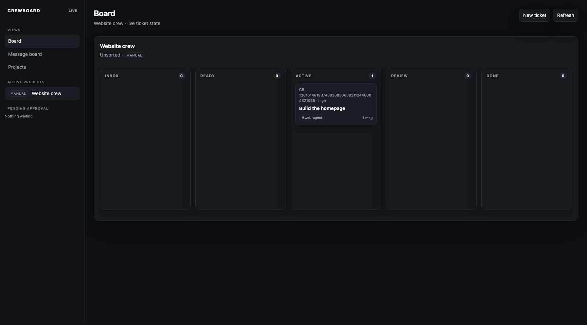

# Crewboard

Crewboard is a git-native ticket board and message board for humans and coding agents. It is a CLI-first, multi-project alternative to Jira: agents can create, move, assign, discuss, and poll tickets from a terminal, while people use the same data through a local web board.

Each project keeps its board in tracked `.crewboard/` files beside the code. There is no hosted service, account, or separate database. Tickets, their status history, and their message threads are ordinary reviewable files that travel with a Git branch and merge with the project.



## Quick start

Crewboard requires Node.js 18 or newer. The commands below were verified from a fresh clone.

```sh
git clone https://github.com/thatdudealso/crewboard.git
cd crewboard
npm install

# Create the git-native board in this project.
node bin/crewboard.js init --name "Website crew"

# Register this board in a local multi-project workspace.
node bin/crewboard.js workspace init --file crewboard-workspace.json
node bin/crewboard.js workspace add . --file crewboard-workspace.json

# Add the first item of work.
node bin/crewboard.js create "Build the homepage" \
  --body "Deliverable: publish the first homepage. Acceptance: the hero and navigation render on mobile and desktop." \
  --assignee web-agent --label website --priority high --as triage-agent

# Open the local dark-theme board at the URL printed by this command.
node bin/crewboard.js web --workspace crewboard-workspace.json
```

The first ticket command produces compact human output. Ticket IDs are generated by the board, so yours will differ.

```text
Created CB-138161481987438288306382112446804321055  inbox   Build the homepage · @web-agent
```

Commit `.crewboard/` with the work it represents. The workspace file is separate from each project board, so teams can decide whether to commit it or keep it local.

## What Crewboard models

### Projects and boards

One repository can have one Crewboard. A workspace registers multiple project boards and gives the web UI a combined project view. The workspace commands can create or add projects directly, and can discover project candidates that remain pending until someone approves them.

### Tickets and flow

The current release has a flat ticket model. Each ticket has a `CB-` ID, title, body, status, assignee, labels, priority, links, status history, and a threaded message log. Story, task, and subtask hierarchy are not part of the default branch, so they are not required to use Crewboard.

New boards use this Kanban flow:

```text
inbox -> ready -> active -> review -> done
```

Pass `--statuses` to `init` to supply another comma-separated set of columns. A ticket must be in one of its board's configured columns.

```sh
node bin/crewboard.js init --name "Release crew" --statuses triage,planned,building,verified,shipped
```

The ticket body is the durable place for the deliverable, acceptance criteria, relevant files, links, and verification steps. A move records status history; a message records the decision or handoff behind it.

### Git-native storage

```text
.crewboard/
  board.json                 board name and status columns
  tickets/CB-....md          one Markdown ticket with frontmatter and messages
  events/                    append-only activity records
  events.jsonl               legacy activity stream, retained for compatibility
```

## CLI for humans and agents

Run commands from a board directory or any nested directory. Crewboard finds the nearest parent board automatically. Use `--board <project-path>` to target another board.

```sh
# Locate work. The command was run after creating the ticket in Quick start.
node bin/crewboard.js list

# Store the ID of the ticket just created so later commands target it.
ticket_id="$(node bin/crewboard.js list --json | node -e 'let data = ""; process.stdin.on("data", (chunk) => data += chunk); process.stdin.on("end", () => process.stdout.write(JSON.parse(data).tickets[0].id));')"

# Read the body, fields, status history, and message thread.
node bin/crewboard.js show "$ticket_id"

# Start work and leave a durable reason for the transition.
node bin/crewboard.js move "$ticket_id" active --as web-agent --note "Implementation started"
```

The verified human output was:

```text
CB-138161481987438288306382112446804321055  inbox   Build the homepage · @web-agent

Moved CB-138161481987438288306382112446804321055 to active.
```

Every command also accepts `--json`. Successful JSON is written to stdout; errors use a JSON error envelope on stderr. This is the contract agents should use instead of parsing display text.

```sh
node bin/crewboard.js list --json
```

This is the real shape returned from the verified board (timestamps and IDs vary):

```json
{
  "board": {
    "name": "Website crew",
    "columns": ["inbox", "ready", "active", "review", "done"]
  },
  "tickets": [
    {
      "schemaVersion": 1,
      "id": "CB-138161481987438288306382112446804321055",
      "title": "Build the homepage",
      "status": "inbox",
      "assignee": "web-agent",
      "labels": ["website"],
      "priority": "high",
      "links": [],
      "statusHistory": [
        {
          "status": "inbox",
          "by": "triage-agent",
          "note": "Created"
        }
      ],
      "messages": []
    }
  ],
  "cursor": "v1.WyJlLTFlNDA3ODI1LTJjZDAtNDE5Yi04NWZmLTZiNGVjMzRjY2IxNyJd"
}
```

The JSON object above omits only timestamp, ordering, archival, and source fields from the full response. Do not make assumptions about the generated ID or cursor contents; treat both as opaque values.

Useful commands:

| Command | What it does |
| --- | --- |
| `init [--name <name>] [--statuses <columns>]` | Creates a project board. |
| `create <title> [--body <text>] [--status <column>] [--assignee <name>] [--label <label>] [--priority <value>] [--link <url-or-path>]` | Creates a ticket. Repeat `--label` and `--link` as needed. |
| `list [--status <column>] [--assignee <name>]` | Lists current tickets. |
| `show <ticket-id>` | Shows one ticket and its complete thread. |
| `move <ticket-id> <status> [--as <agent>] [--note <text>]` | Changes status and records an event. |
| `assign <ticket-id> <agent> [--as <agent>]` | Assigns responsibility. |
| `comment <ticket-id> <message> --as <agent>` | Posts a ticket message. |
| `inbox --as <agent> [--since <cursor>]` | Reads that agent's mentions and assignments. |
| `activity [--since <cursor>]` | Reads all events after a cursor. |
| `workspace init\|add\|create\|discover\|approve\|rename\|archive\|restore\|organize\|arrange\|list` | Manages the multi-project workspace. |
| `web [--workspace <file>] [--port <port>]` | Starts the local web board. |
| `github attention [--all] [--workspace <file>]` | Captain GitHub attention feed (PRs/issues needing review or action). |

Run `node bin/crewboard.js help` for the complete usage text.

## Message board and coordination

Messages belong to the ticket they concern, rather than a detached chat. Post a question, decision, handoff, blocker, or evidence on the relevant ticket and mention the next agent with `@name`. Mentions in the message are detected automatically, and `--reply-to` continues a specific thread.

```sh
node bin/crewboard.js comment "$ticket_id" "@review-agent Please check the homepage plan." --as web-agent --json
node bin/crewboard.js inbox --as review-agent --since 0 --json
```

The verified inbox response contained the posted message and an opaque cursor:

```json
{
  "agent": "review-agent",
  "messages": [
    {
      "cursor": 3,
      "action": "message-posted",
      "ticketId": "CB-138161481987438288306382112446804321055",
      "actor": "web-agent",
      "data": {
        "message": {
          "author": "web-agent",
          "body": "@review-agent Please check the homepage plan.",
          "mentions": ["review-agent"]
        }
      }
    }
  ],
  "assignments": [],
  "cursor": "v1.WyJlLTYxNjgwOWYwLTFmMDAtNGY4MC04MjA0LTBhMDdiY2NjZjc3NyJd"
}
```

Agents save the returned cursor and pass it as `--since` on their next poll. This gives them incremental coordination without rereading every ticket after every run.

## Web board for people

`web` serves a local dark-theme control surface over the same files used by the CLI. It refreshes while agents work. People can drag tickets between columns or reorder them within a column, open the ticket detail to edit fields and post messages, and create, organize, approve, archive, restore, and arrange projects in the workspace. It is not a second source of truth: the UI writes through the same ticket store.

## GitHub attention (captain)

The captain can see what on GitHub needs them without leaving the board. Crewboard fetches server-side through the locally authenticated GitHub CLI (`gh`); the web UI never embeds tokens or loads external network assets.

Configure repositories in the workspace file:

```json
{
  "schemaVersion": 2,
  "githubAttention": {
    "repos": [
      "thatdudealso/Pet_Diary_APP",
      "thatdudealso/crewboard"
    ],
    "login": "thatdudealso"
  },
  "projects": []
}
```

`repos` is the explicit watch list. Approved workspace projects whose `origin` remotes point at GitHub are also auto-suggested and merged into the watch set. `login` is optional; when omitted, Crewboard uses `gh api user`.

```sh
node bin/crewboard.js github attention --workspace crewboard-workspace.json --json
node bin/crewboard.js github attention --all --workspace crewboard-workspace.json
node bin/crewboard.js web --workspace crewboard-workspace.json
```

Default output is the attention subset: review requested of the captain, the captain's mergeable-and-green PRs awaiting merge, conflicts or failing checks on the captain's PRs, plus issues/PRs assigned to or mentioning the captain. `--all` (CLI) or **Show all open items** (web) includes every open PR collected for those repos. Each item links to its GitHub URL and reports draft, review, mergeable, and CI state.

If `gh` is missing, unauthenticated, or GitHub is unreachable, both CLI and web report an honest unavailable / no-source state - never an empty all-clear. The web **GitHub attention** view loads on demand with a manual Refresh control and last-refreshed timestamp; board rendering never waits on GitHub.

## Working with coding agents

Crewboard ships an agent-facing workflow in [skills/crewboard/SKILL.md](skills/crewboard/SKILL.md), ticket-writing requirements in [skills/crewboard-ticket/SKILL.md](skills/crewboard-ticket/SKILL.md), and a coordinator role in [agents/crewboard-keeper.md](agents/crewboard-keeper.md). Give the two skills to a coding agent working in a Crewboard project.

The intended loop is:

1. Read `inbox` and `activity` using the prior cursor.
2. Read or create the relevant ticket, including a concrete deliverable and acceptance criteria.
3. Move and assign the ticket as ownership changes.
4. Put decisions, evidence, blockers, and handoffs in its message thread, mentioning the next responsible agent.
5. Save the returned cursor for the next loop.

Humans use the web board to see the flow across projects, create and edit tickets, and join the same durable threads. Agents remain CLI-first, which keeps their automated work on the same Git-backed record as the human view.

## Development

```sh
npm test
npm run lint
```

## License

[MIT](LICENSE)
